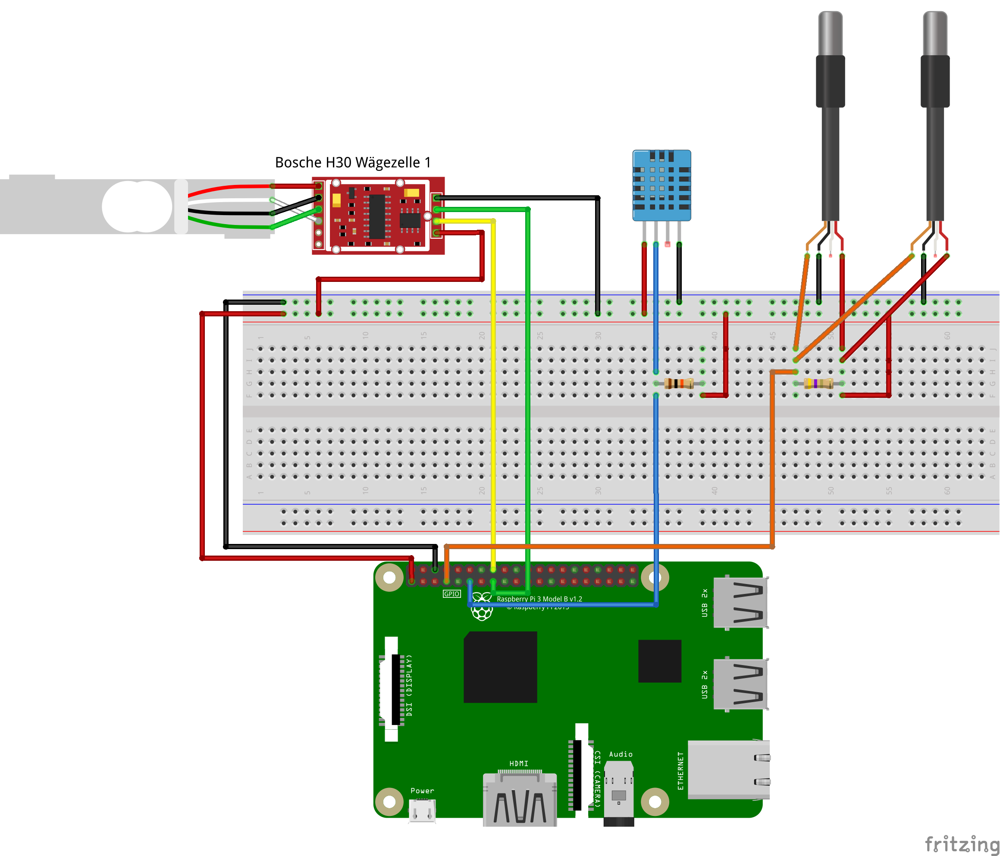

**This branch is currently unmaintained!**
We switched to the BeagleBone Black. Changes will not be ported to this branch!

# What is this?

This program is written for the Raspberry Pi.
It periodically reads data from different sensors and logs it to local files and sends it to a server using [MQTT](http://mqtt.org/).

Currently implemented sensors:

- DS1820: Temperature
- DHT22: Temperature and humidity
- HX711: Weight

The program was written to monitor bee hives, but it can also be used for other applications.

If you want to learn more about beehive monitoring, checkout <https://hiveeyes.org/>.

# Overview

In this document you can find important information about the program and the installation process.

First, we address the [hardware](#hardware) hardware you will need.

Second, we describe the installation process. You can choose between [installing an image file](#easy) (recommended way) or a [custom, manual installation](#custom). For advanced usecases, you might want to [build your own image](#build).

Finally, we provide you with [more information](#generalprocedure) about the program.

# Directory Structure
  - Hiverize-2018-12-16-lite.img.zip: If you choose the [easy installation process](#easy) this is really all you need
  - /hiverize: contains the source code of the program, important only for the [custom installation](#custom)
  - /rpi-system: contains optional files needed for the [custom installation](#custom), for example if the program should run automatically after booting
  - /pi-gen: contains script for the creation of own images
  - hiverize.fzz: can be used to visualise the hardware
  

# <a name="hardware"></a> Hardware

With the default wiring of the Raspberry Pi you can use the image without any changes to the configuration file. The program should work even if not all sensors are connected.



In order to calibrate the scale, you need a notebook or smartphone.

If you want online access to the data, your Raspberry Pi needs an internet connection, either wireless LAN or using an ethernet LAN cable.

If you want to follow the custom installation instruction, you might also need monitor and keyboard.

# Installation

## <a name="easy"></a> The easy way

The easiest way to install is by flashing the provided image.

### Flashing the Hiverize image

Download and extract the most recent image in <https://seafile.zfn.uni-bremen.de/d/225b749146394c41aa5c/>.

If you don't know how to flash an image use one of the following guides with the Hiverize image you downloaded instead of a Raspbian image.

***Windows***: See Raspberry installation guide for [Windows](https://www.raspberrypi.org/documentation/installation/installing-images/windows.md)

***Linux***: 
In most Linux distributions you can right click on the image and open it with 
"Disk Image Writer" or "Start-Up Disk Creator". Follow the instructions to choose
the destination of the image. 
More advanced instructions can be found in the 
Raspberrry installation guide for [Linux](https://www.raspberrypi.org/documentation/installation/installing-images/linux.md)

***MacOS***: See Raspberry installation guide for [MacOS](https://www.raspberrypi.org/documentation/installation/installing-images/mac.md)

Afterwards put the SD card in your Raspberry Pi, make sure all sensors
 are connected properly and plug in the power cable. 
 The Raspberry Pi is going to boot as soon as you connected the cable.

### Configuration using the webinterface

**The webinterface is work in progress and not all features are tested!**

On the first start the Raspberry Pi opens a WiFi access point to configure the program.
Connect your notebook or smartphone to the access point `HiverizeAP` with the password 
`bienenprojekt`. To access the webinterface your mobile data has to be turned off!

Open your browser and go to the address `10.10.10.1:5000`. 
On this website you can edit your network settings and calibrate the scale.

**Network/ Netzwerk**: Your Raspberry Pi needs an internet connection in order to give online access to the data. You can use an ethernet cable or configure WiFi (WLan). 
If you do not have the opportunity to connect your Raspberry Pi to internet, the data is still stored locally.

**Seonsors/ Sensoren**: Shows a list of all connected sensors.

**Scale calibration/ Waage kalibrieren**: Before using your scale, you must calibrate it. Remove all weights from your scale and click "continue/weiter". Put a weight of 1 kg on the scale and click "continue/weiter". You will be forwarded to the sensor overview page. The sensor HX711 should show a value of approximately 1.

**Download**: Click here to download the measured data. (If you altered some configuration, you might want to restart your Raspberry Pi before the download.)

When everything is configured restart the Raspberry Pi by clicking `Restart` in the 
webinterface. This will also start the programm and your Raspberry Pi is going to measure 
and log the data.

The access point is created after a restart if the network connection fails.

If you want to understand what the program does, you might want to read about the [general procedure](#generalprocedure).

## <a name="custom"></a> Custom installation

If you have a Raspberry Pi running Rasbian you can install the program manually.

If you want to use the DS1820 you need to activate the 1-wire 
interface.
Open your ```/boot/config.txt``` and add following line:

```dtoverlay=w1-gpio,gpiopin=4```

You can find more information in [this guide from Adafruit](https://learn.adafruit.com/adafruits-raspberry-pi-lesson-11-ds18b20-temperature-sensing/ds18b20). 

### Dependencies

For measurement and webinterface different packages are needed.

#### Measurement

The Python program to read from the sensors needs the following packages:

- `python3-rpi.gpio`: Package to access the GPIOs of the Raspberry Pi
- `python3-numpy`: Package used for scientific computing, in this program used to read from the HX711
- `Adafruit_DHT`: Library to read from DHT11/DHT22 from Adafruit
- `paho-mqtt`: Library to send data using the MQTT protocol

Install these packages on Raspbian with

```bash
sudo apt install python3-rpi.gpio python3-numpy 
sudo pip3 install Adafruit_DHT paho-mqtt
```

#### Webinterface (optional)

If you want to use the webinterface and the access point you need some additional packages:

- `python3-flask`: Framework used for the webinterface
- `gunicorn3`: Server to access the webinterface
- `network-manager`: Program to manage network connections
- `wireless-tools`: Additional tools to manage WiFi connections
- `python-networkmanager`: Python bindings for NetworkManager
- `python-pydbus`: Python access to D-Bus
- `dnsmasq`: DHCP server for the access point
- `zip`: Download all data via the webinterface

Install these packages on Raspbian with

```bash
sudo apt install python3-flask python-pydbus gunicorn3 network-manager wireless-tools dnsmasq zip
sudo pip3 install python-networkmanager
```

### Install the Python program

When all required packages are installed you just need to copy the `hiverize` folder to your Raspberry Pi.
Adjust the paths in `hiverize/hiverizewaage.conf`.

### Run

You can now start the measurement by running

```bash
python3 -m hiverize.measure
```

For more verbosity you can change the loglevel, e.g to debug something:

```bash
python3 -m hiverize.measure --loglevel=DEBUG
```

If this command fails check if you are in the right directory! As long as the hiverize package is not installed you need to run this from the parent directory. (Meaning: If yout run `ls` you should see the hiverize folder.)

### Install system files (optional)

All system files are in the folder `rpi-system`. 
If you want to use some extra features described in the next sections,
you will need to copy this files to your Raspberry Pi.
The folder structure of `rpi-system` is 
the same as the structure of your Raspbian system.

#### Autostart the program and webinterface
      
Copy the files `webinterface.service` and `hiverize.service` 
from/to the folder `/etc/systemd/system`.
Make sure the paths in this files point to the location of the hiverize
directory on your system.

 Set the permissions 
to `644`:

```sudo chmod 644 hiverize.service```

If you install the files on a running system you need 
to reload the systemd daemon with `sudo systemctl daemon-reload`.  
Enable autostart of the programm and webinterface by running 
`sudo systemctl enable hiverize webinterface`.

You should reboot your Raspberry Pi with ```sudo reboot```.

##### Permissions for the webinterface

The user which runs the webinterface (per default the user `pi`)
 needs additional permissions to configure the network interfaces. 
 For this install the
 file `/etc/polkit-1/localauthority/50-local.d/org.freedesktop.NetworkManager.pkla` 
 with the permissions set to `700`. If this doesn't work, double-check
  the permissions!

The user also needs the permissions to restart the pi and 
start the systemd service. To allow this add the following two lines
 to the file `/etc/sudoers`:
    
```
pi localhost=NOPASSWD: /bin/systemctl enable hiverize.service
pi localhost=NOPASSWD: /sbin/shutdown
```

#### Configure DHCP for the access point

If you want the access point to give you automatic IP addresses you need
 to configure `dnsmasq`. Edit the `/etc/dnsmasq.conf` and add:

```
interface=wlan0
dhcp-range=10.10.10.10,10.10.10.100,12h
```

#### Profile of the access point

NetworkManager needs a profile for our access point. 
To install it copy the file `/etc/NetworkManager/system-connections/wifi-ap` 
and set the permissions to `700`.

### Advanced configuration

To configure the program without the webinterface edit the file 
`hiverize/hiverize.conf`.
If you want to send data to our server it is important to change at least
 the name in the configuration file.

### How to run

You can now start the measurement by running

```bash
python3 -m hiverize.measure
```

For more verbosity you can change the loglevel, e.g to debug something:

```bash
python3 -m hiverize.measure --loglevel=DEBUG
```

If this command fails check if you are in the right directory! As long as the hiverize package is not installed you need to run this from the parent directory. (Meaning: If you run `ls` you should see the hiverize folder.)

## <a name="build"></a> Advanced: Build your own image

The provided image is build using [`pi-gen`](https://github.com/RPi-Distro/pi-gen/).

### Required packages

To build images you need the following packages:

- `git`: To clone the git repository
- `rsync`: Easy way to copy many files 

### Setup pi-gen

Clone the `pi-gen` repository from GitHub:

```bash
git clone https://github.com/RPi-Distro/pi-gen.git
```

Set the name of the image, e.g. to 'Hiverize'.

```bash
cd pi-gen
echo "IMG_NAME='Hiverize'" > config
```

If you only need a lite image add `SKIP` and `SKIP_IMAGES` files to the stages after stage2.

```bash
touch ./stage3/SKIP ./stage4/SKIP ./stage5/SKIP
touch ./stage4/SKIP_IMAGES ./stage5/SKIP_IMAGES
```

At this point you could start the build process and would get the default Raspbian lite image.

### Add hiverize files to stage2

Open a terminal in the directory of the hiverize repository

```bash
cd pi-gen
sh prepare-stage.sh
```

Now just copy the folder `pi-gen/stage2/03-hiverize` to the folder `stage2` in your pi-gen setup. If you want to build the image on a remote server just use `rsync` to copy the files

```bash
rsync -re 'ssh' . root@YOUR.SERVER.IP.ADDRESS:pi-gen/
```

### Customize the image

Now you can customize the image that is going to be build. If you want to understand the build process please read the documentation of the `pi-gen` project.

### Build image

Switch to the terminal where you cloned `pi-gen`, enter the directory and start the build process

```bash
./build.sh
```

If your system is missing required packages it will notify you.

### Problems:

If you compile on a different architecture than ARM the build might fail with the error message

```
chroot: failed to run command '/debootstrap/debootstrap': Exec format error
```

Because we build on a different architecture the script uses QEMU to chroot into the Raspberry Pi image. On some systems the QEMU libraries for the file format don't get installed properly.

I'm not entirely sure what this string to register the library contains, but the error is fixed by running

```bash
echo ':arm:M::\x7fELF\x01\x01\x01\x00\x00\x00\x00\x00\x00\x00\x00\x00\x02\x00\x28\x00:\xff\xff\xff\xff\xff\xff\xff\x00\xff\xff\xff\xff\xff\xff\xff\xff\xfe\xff\xff\xff:/usr/bin/qemu-arm-static:' > /proc/sys/fs/binfmt_misc/register
```

Maybe you need to empty the folder `pi-gen/work` before restarting the build process.

# <a name="generalprocedure"></a> General Procedure, File Format

In detail, the following steps are automatically done by using the Hiverize-Image after you boot the Raspberry Pi with the Hiverize-MicroSD-Card.

1. The process manager system "systemd" starts a service named "hiverizewaage"
2. The service "hiverizewaage" runs the Python-program, that reads out the sensors attached to the Raspberry Pi
3. The started Python-program stores the data from the sensors in text format
4. The data in text format is placed into */home/pi/hiverizelog/* 
    In this folder, the Python-program automatically creates a subfolder for **every day** of the measurements. In this subfolder, **every hour** a new file is created.
5. In this file, you will find the data with following structure

    **Unix-timestamp, HX711 data, DHT11 data, DS1820 data[0],DS1820 data[1],...,           DS182 data [n]**
    (Note: The 1-Wire bzs does not have a limit for the number of DS1820-sensors you can attach, therefore the endpoint of the DS1820-array has no limit: [n]
    In our tests, we normally attached 2-4 DS1820-sensors to the 1-Wire bus)


# Development

## Add a sensor
